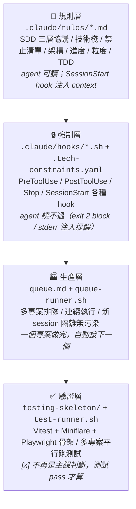

# AI-Meka

> 讓 AI coding agent 跨 session 持續工作的合約系統 + 多專案生產線。

AI coding agent（例如 Claude Code、Cursor、Aider 等等）速度快，但有兩個痛點會毀掉長期專案：跨 session 失憶、偏離原本的規格。AI-Meka 是一套把「該做什麼 / 做到哪 / 不准做什麼」外部化成檔案的合約系統，再疊一層 hook 強制執行，agent 繞不過。最後用一支 queue-runner，讓你可以一次排多個專案讓它連續做下去。

---

## 為什麼叫 Meka？

Meka 是日本動漫裡的機甲（メカ）。

AI coding agent 天生能力強大，但沒有記憶、沒有約束——像一個超強的飛行員坐在敞篷座艙裡，風一吹就忘了目的地。AI-Meka 就是那套機甲：給它裝上外掛記憶（`tasks.md`、hook 注入），給它穿上外骨骼約束（`pre-write-guard`、tech constraints），然後放它全速出擊。

機甲穿上去之前，agent 會亂跑；穿上去之後，它在規則內才是真的快。

---

## 為什麼需要它

### 痛點 1：偏離規格

你在討論時說「用 TinyGo 寫 WASM」，agent 開工一陣後忘了，交回一份 TypeScript。技術棧約束在聊天記憶裡、在 `CLAUDE.md` 的說明段落裡，都是軟規範，context 壓縮時首先被丟掉。

AI-Meka 的解：`.tech-constraints.yaml` 是結構化檔案，`pre-write-guard.sh` hook 在每次寫檔前 `grep` 它的 `forbidden_extensions` / `allowed_extensions`。agent 想寫 `.ts` 直接 `exit 2` block，訊息回到 agent context 裡。它看得懂、會自我修正，因為不是「我不該寫 TS」，是「我寫 TS 會被擋」。

### 痛點 2：跨 session 失憶

重啟一個 session，agent 瞬態的 todo list 消失，不知道上個 session 做到哪、下個 task 是什麼。

AI-Meka 的解：`tasks.md` 是外部記憶。每個 task 有狀態標記（`[ ]` / `[🔄]` / `[x]`）和 Checkpoint 欄位。新 session 啟動時 `session-start-load-sdd.sh` hook 把「哪個 task 在進行中」注入 context。agent 每次開工先讀 tasks.md，知道從哪接。

### 痛點衍生：`[x]` 是主觀判斷

就算 agent 有在更新 tasks.md，標 `[x]` 仍然代表「agent 覺得做完了」。沒測試保護的話，下個 task 改動了共用函式，前一個 task 默默壞掉，tasks.md 卻顯示一片綠。

AI-Meka 的解：**TDD 協議**。每個 task 在 tasks.md 有 `Test File` 欄位，標 `[x]` 的條件是「該 Test File 存在 + 本次 session 跑過 + 全部 pass」。`post-edit-check-tdd.sh` hook 偵測 `[x]` 被寫入時，在 stderr 注入強制自我檢核提醒，agent 下一輪推理必須回報測試執行結果。

---

## 四層機制架構



---

## 目錄結構

```
AI-Meka/
├── README.md                              ← 本檔
├── queue.md                               ← 專案排隊清單
├── queue-runner.sh                        ← 生產線主管（長駐 terminal）
├── test-runner.sh                         ← 多專案平行測試
├── running.log                            ← 執行歷史
├── test-report.md                         ← 測試報告（test-runner 產出）
├── HOW-TO-WRITE-SDD.md                    ← 給 agent 的 SDD 產出指引
│
└── template/                              ← 新專案模板（複製到新 project）
    ├── CLAUDE.md                          ← 精簡索引 + 跨 session 合約
    ├── .tech-constraints.yaml             ← 技術棧硬約束（hook 讀取）
    │
    ├── .claude/
    │   ├── settings.json                  ← Hook 設定
    │   ├── rules/
    │   │   ├── 00-sdd-protocol.md         ← SDD 三層協議（req → design → tasks）
    │   │   ├── 01-tech-stack.md           ← 技術棧（說明性）
    │   │   ├── 02-forbidden.md            ← 禁止清單（hook 強制）
    │   │   ├── 03-architecture.md         ← 架構規範
    │   │   ├── 04-current-progress.md     ← 當前進度
    │   │   ├── 05-task-granularity.md     ← Task 粒度紀律
    │   │   └── 06-tdd-protocol.md         ← TDD 協議（[x] 前測試必須 pass）
    │   ├── hooks/
    │   │   ├── session-start-load-sdd.sh
    │   │   ├── pre-write-guard.sh         ← 讀 .tech-constraints.yaml 強制擋
    │   │   ├── pre-bash-guard.sh
    │   │   ├── post-edit-remind-tasks.sh
    │   │   ├── post-edit-check-tdd.sh     ← TDD 強制自我檢核
    │   │   └── stop-check-sync.sh
    │   └── commands/
    │       ├── spec/{new,approve-req,approve-design,impact,scope-check,status}.md
    │       ├── task/{run,run-all,next}.md
    │       └── steering/{add,list}.md
    │
    ├── .agents/
    │   └── specs/
    │       └── _example-feature/          ← 範例 SDD（格式參考）
    │
    └── testing-skeleton/                  ← 測試環境骨架
        ├── package.json                   ← Vitest + Playwright + Miniflare
        ├── vitest.config.ts               ← unit + integration 兩個 project
        ├── playwright.config.ts
        ├── tsconfig.json
        └── tests/
            ├── unit/example.test.ts
            ├── integration/example-miniflare.test.ts
            ├── e2e/example.spec.ts
            └── fixtures/
```

---

## 快速開始

### 模式 A：單一專案

```bash
# 1. 複製模板到你的 project
cd /path/to/my-new-project
cp -R /path/to/AI-Meka/template/.claude ./
cp -R /path/to/AI-Meka/template/.agents ./
cp    /path/to/AI-Meka/template/CLAUDE.md ./
cp    /path/to/AI-Meka/template/.tech-constraints.yaml ./

# （可選）把測試骨架也複製過去
cp -R /path/to/AI-Meka/template/testing-skeleton/. ./

# 2. 給 hooks 執行權限
chmod +x .claude/hooks/*.sh

# 3. 裝必要工具
which jq || brew install jq          # hook 解析 tool input
which yq || brew install yq          # 解析 .tech-constraints.yaml（可選但推薦）

# 4. 刪範例 spec（避免被 agent 誤認為真任務）
rm -rf .agents/specs/_example-feature/

# 5. 填兩個關鍵檔案
vi CLAUDE.md                         # 填 PROJECT_NAME 等
vi .tech-constraints.yaml            # 填技術棧約束

# 6. 啟動你的 AI coding agent（目前驗證對象是 Claude Code）
claude
```

### 模式 B：多專案生產線

```bash
# 1. 每個 project 先做好模式 A 的 setup（含 SDD）
# 2. 編輯 queue.md 加一行：
#    我的新專案 | /absolute/path/to/project

# 3. 啟動 queue-runner（長駐 terminal）
cd /path/to/AI-Meka
./queue-runner.sh

# 它會：
# - 讀 queue.md 第一個未執行的 project
# - 標記 # RUNNING
# - cd 進去、啟動 agent（Yolo 模式）
# - agent /exit 後標記 # DONE
# - 自動接下一個，新 session 隔離無污染
# - queue 空時每 30 秒檢查一次（你可以隨時加新 project）
```

### 檢查測試狀態

```bash
# 只測已完成（# DONE）的專案
./test-runner.sh

# 測 queue.md 所有專案
./test-runner.sh --all

# 只測某一個
./test-runner.sh 我的新專案

# 平行度限制
./test-runner.sh --all --jobs 2
```

產出：
- `test-report.md` — Markdown 格式的總覽 + 失敗輸出
- `.test-runner-logs/<project>.log` — 每專案完整輸出

自動偵測 `package.json` / `go.mod` / `Cargo.toml` / `pyproject.toml` / `Makefile` 決定用什麼指令跑。

### 跟 agent 一起產出新專案的 SDD

`HOW-TO-WRITE-SDD.md` 是給 agent 看的指引。複製貼進 agent 對話裡，它會按 AI-Meka 的格式產出 `requirements.md` / `design.md` / `tasks.md`（含 Test File 欄位）。

---

## 設計哲學

**規則要硬，放飛要野。**

- **硬**：`.tech-constraints.yaml` + hooks 是強制層，agent 繞不過
- **野**：在硬規則內，agent 用 `--dangerously-skip-permissions`（或對等的自動化模式）全速放飛，不浪費時間問你確認

**速度和紀律不衝突，前提是紀律是程式化的、不是靠自律的。**

三個具體原則：

1. **記憶外部化**。agent 內部的 context 會壓縮、會失憶。凡是跨 session 需要記得的，寫進 `.md` / `.yaml` 檔，讓新 session 開工時由 hook 注入。
2. **規則可執行化**。「CLAUDE.md 寫了不可以做 X」沒用，context 壓縮後就忘。「pre-write hook 偵測 X 並 exit 2」才有用，因為它是程式。
3. **進度信號可驗證**。`[x]` 不能是主觀判斷。TDD 協議把它綁到測試執行結果上，信號才不會失真。

---

## 目前驗證對象 vs 設計通用性

目前主要驗證對象是 Claude Code — `.claude/hooks/` 的 hook 格式、`settings.json` 的 event names 都是 Claude Code 的慣例。

但設計上不綁死 Claude：

- **規則層**是純 `.md`，任何能讀檔的 agent 都能消化
- **強制層**是 bash scripts，任何能被 shell hook 攔截的 agent runtime 都能掛
- **生產層**的 `queue-runner.sh` 呼叫的 CLI 指令是參數化的（目前是 `claude`，改成 `cursor-agent` / `aider` 等不難）
- **驗證層**與 agent 完全無關

若你把這套適配到別的 agent runtime，hook 目錄結構可能要調整，但核心概念（檔案化的合約 + hook 強制 + 外部記憶）是通用的。

---

## 文件索引

| 檔案 | 用途 |
|-----|------|
| `template/CLAUDE.md` | 專案根層的最高原則 + 跨 session 合約 |
| `template/.tech-constraints.yaml` | 技術棧硬約束（hook 讀取的唯一來源） |
| `template/.claude/rules/00-sdd-protocol.md` | SDD 三層協議 |
| `template/.claude/rules/05-task-granularity.md` | Task 粒度紀律 |
| `template/.claude/rules/06-tdd-protocol.md` | TDD 協議 |
| `template/.claude/hooks/*.sh` | 強制執行機制 |
| `template/testing-skeleton/` | Vitest + Miniflare + Playwright 骨架 |
| `queue.md` | 專案排隊清單 |
| `queue-runner.sh` | 生產線主管 |
| `test-runner.sh` | 多專案平行測試 |
| `HOW-TO-WRITE-SDD.md` | 給 agent 的 SDD 產出指引 |

---

## 授權

MIT。

---

## Acknowledgments

這個系統是跟 Claude（Anthropic）一起迭代設計出來的。Claude 同時扮演兩個角色：**被這套規範約束的對象**（測試「agent 會不會照 rules 走、hook 會不會攔得住」必須用一個真實的 agent 來驗證），以及**討論規則該怎麼寫的合作者**（幾乎每一條 rule、每一個 hook 的邊界條件，都是在對話裡辯論出來的）。

特別是把「什麼叫做 task 完成」外部化到 TDD 協議 / Test File 欄位這個設計，以及「context 壓縮必然發生，所以記憶要寫回檔案」的取捨，是這樣一步步磨出來的結論。感謝 Anthropic 做出一個強到值得被認真規範的模型，也感謝 Claude 在被擋下時會告訴我「這條 hook 其實會誤殺 X 情境」而不是默默繞過。
